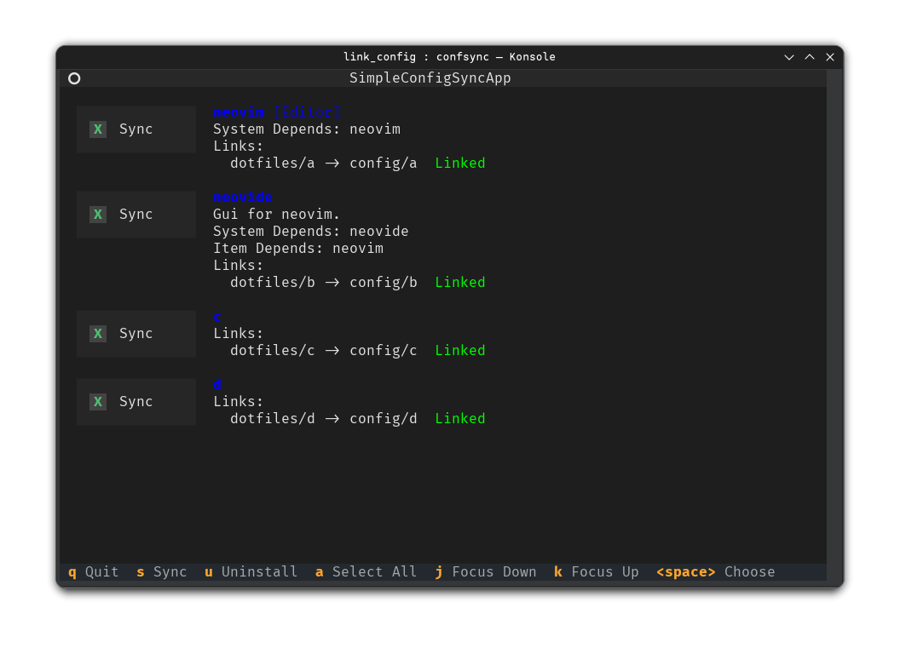

Used for synchronizing dotfiles across various Linux devices, capable of automatically creating links, automatically deleting links, and selectively synchronizing files.

## Preview



## Install

```shell
# Global
pip install simple-config-sync
# For user
pip install --user simple-config-sync
```

## Configuration

Generate a `config-sync.toml` file.

```shell
confsync init
```

## Usage

Run the tui program.

```shell
confsync tui
```
